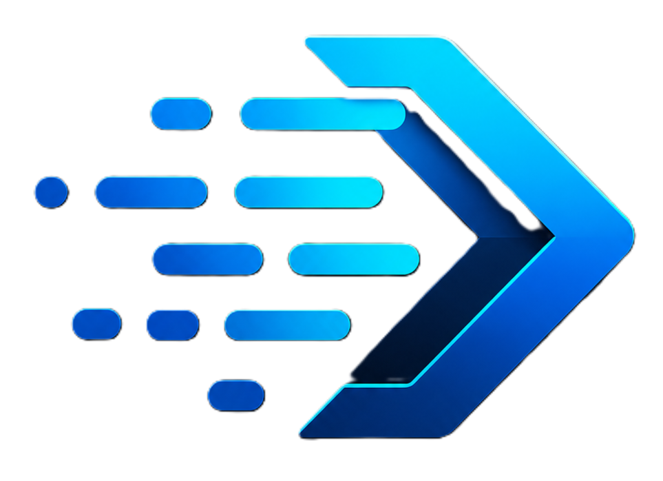
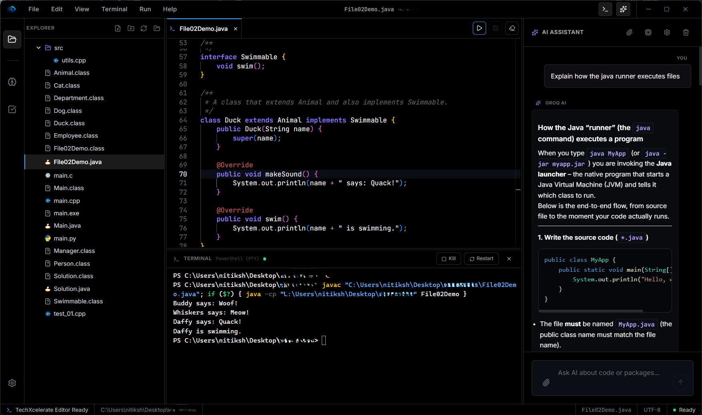

#  techXcelerate Editor

**techXcelerate Editor** is a highly polished, standalone desktop environment designed for creators, analysts, and developers. Packed with an **integrated multi-language terminal runner** (supporting Rust, C/C++, Java, Python, Go, JS/TS, and more) and integrated with **Agentic AI Assistants**, it provides a high-performance workspace to write, run, and optimize code instantly on your system.

---

## 🌟 Visual Showcase

*The ultra-premium glassmorphism workspace featuring Monaco editor, integrated file tree, terminal execution, and context-aware AI chat sidebar.*

---

## ✨ Core Product Pillars

### 📦 Universal Code Execution Engine
* **Click & Run:** Compile and run multiple languages (Rust, C/C++, Java, Go, Python, JavaScript, TypeScript, and more) directly inside the built-in terminal.
* **Embedded Python Runtime:** Comes pre-packaged with an isolated, zero-setup embedded Python environment for immediate scripting.
* **Isolated Workspace Context:** Keeps your execution environment perfectly clean and safe from global system dependencies.

### 🧠 Local Agentic AI Coding Assistant
* **Bring Your Own Key (BYOK):** Seamlessly connect your **Gemini** or **Groq** API keys for zero-subscription, pay-as-you-go AI power.
* **Context-Aware Pair Programmer:** The AI has full local reading capabilities. Drag and drop files, attach directories, and ask questions about your entire project structure.
* **Step-by-Step Execution Planner:** Understands compiler/runtime errors, highlights bugs, and drafts optimized solutions dynamically.

### ⚡ Developer Friendly Workspace
* **Modern File Tree CRUD:** Full nested folder and file management. Create, rename, edit, and delete files or folders instantly.
* **Smart Debounced Autosave:** Saves your progress smoothly after **2.5 seconds** of inactivity, completely protecting you from data loss without lag or system bloat.

### 🎨 High-Fidelity Design Aesthetics
* **Atmospheric Dark Theme:** Built using customized HSL color systems, smooth gradients, and glassmorphic translucent layers.
* **Micro-Animations:** Fluid layout transitions, streaming chat bubbles, active tab highlights, and responsive sidebar resizing panels.

---

## 📥 Getting Started (Windows Installation)

Follow these simple steps to install the latest **v0.1.1** production release:

1. **Download the Installer:**
   Navigate to our [Releases Page](https://github.com/techxcelerate/code-editor/releases) and download `TechXcelerate-Editor_0.1.2_x64-setup.exe`.
2. **Run the Setup:**
   Double-click the downloaded `.exe` installer. Follow the visual steps to install it locally.
3. **Open and Code:**
   Launch **techXcelerate Editor** from your desktop or Start Menu. Select any local workspace folder and start writing code instantly!

---

## 🔒 Security & Privacy

* **100% Local Execution:** Your files and source code are stored and executed entirely on your local machine.
* **Direct LLM Communication:** Your API keys are encrypted and stored inside your local configuration directory. The application communicates directly with Google Gemini and Groq servers—no middleman servers involved.

---

## ✉️ Contact & Feedback

For product inquiries, feedback, or custom integrations, feel free to contact us or open an issue in this repository. 

*Developed with ❤️ by the **NTXM**.*
contact: [contact@ntxm.org]
